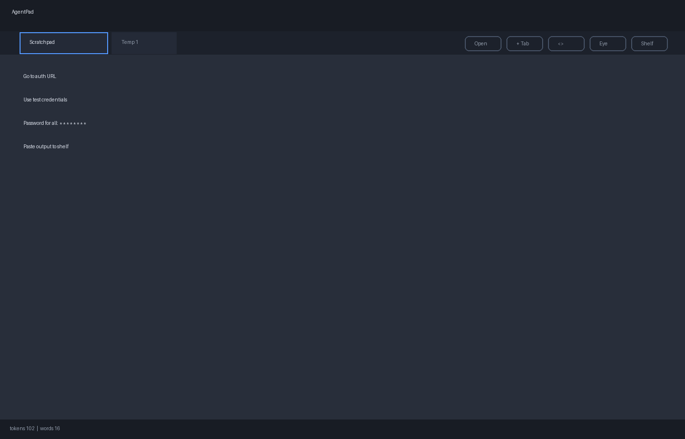
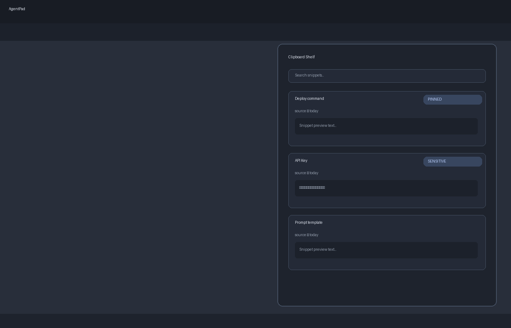

# AgentPad

AgentPad is a local-first desktop markdown workbench for fast LLM-era workflows: markdown and YAML editing, source/split/preview, persistent shelf capture, reusable prompt management, stable tabs, and session continuity.

## Screenshots





## Install

### Option 1: Use a release build (macOS)

1. Build the app:
```bash
npm install
npm run tauri build
```
2. Install to Applications:
```bash
ditto src-tauri/target/release/bundle/macos/AgentPad.app /Applications/AgentPad.app
```
3. Launch like any app from Spotlight/Launchpad, or:
```bash
open -a AgentPad
```

### Option 2: Development mode

```bash
npm install
npm run tauri dev
```

## Core Workflow

- The primary workspace is always available and autosaves locally.
- `+ Tab` or `Cmd/Ctrl+T` creates a temporary working tab.
- `Cmd/Ctrl+S` on a temp tab opens Save As and converts to a file-backed tab.
- `Shelf` stores snippets and quick notes with copy/pin/search/sensitive options.

## Useful Shortcuts

- `Cmd/Ctrl+O`: Open file
- `Cmd/Ctrl+S`: Save
- `Cmd/Ctrl+T`: New temp tab
- `Cmd/Ctrl+Shift+Space`: Jump to the primary workspace
- `Cmd/Ctrl+Shift+K`: Toggle Shelf
- `Cmd/Ctrl+Shift+V`: Add clipboard to Shelf
- `Cmd/Ctrl+Shift+Y`: Add selection to Shelf
- `Cmd/Ctrl+Shift+J`: Focus Shelf search

## Project Stack

- Tauri v2
- Vite
- CodeMirror 6
- markdown-it + DOMPurify
